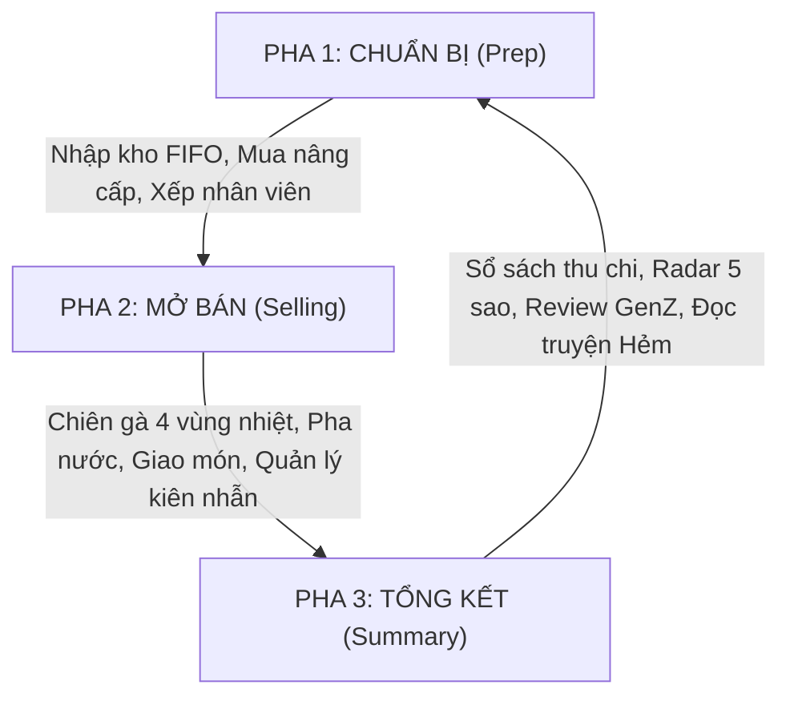

# Game Gameplay Systems & Economy Balancer — Tiệm Gà Nhà Tui

Skill này hướng dẫn Agent (Claude & Gemini) trong vai trò **Chuyên Gia Thiết Kế Hệ Thống & Cân Bằng Kinh Tế (Systems Designer)**, đảm bảo game cân bằng, hấp dẫn, có chiều sâu chiến thuật và không bị lạm phát tiền tệ.

---

## 1. Triết Lý Vòng Lặp Trò Chơi (Core Game Loop)

Game vận hành theo chu kỳ ngày 3 pha khép kín:



### Thời lượng mục tiêu
- **Pha Chuẩn bị:** 30 – 60 giây (người chơi suy tính nhanh).
- **Pha Mở bán:** 3 – 4 phút thời gian thực (tương đương 10:00 → 22:00 trong game, giờ game trôi theo tốc độ 1 giờ game = 15-20 giây thực).
- **Pha Tổng kết:** 30 – 45 giây (tận hưởng thành quả, chia sẻ thẻ Threads).

---

## 2. Mô Hình Dòng Tiền & Thuật Toán Kinh Tế (Economy Flow)

### 2.1. Cấu trúc Sổ Sách Tài Chính (Ledger Formula)

$$\text{Net Profit (Lợi Nhuận Ròng)} = \text{Doanh Thu Bán Hàng} + \text{Tiền Tip} - \text{Chi Phí Vận Hành}$$

Trong đó, **Chi Phí Vận Hành** gồm:
1. **Tiền mặt bằng (Rent):** Cố định theo chương (Chương 1: 0đ → Chương 2: 50.000đ/ngày → Chương 3: 250.000đ/ngày...).
2. **Lương nhân viên (Wages):** Trả theo ngày dựa trên hợp đồng nhân sự.
3. **Điện nước (Utilities):** Tỷ lệ thuận với số mẻ chiên và số giờ mở bán.
4. **Hao hụt hàng hết hạn (Waste Cost):** Trừ giá vốn của nguyên liệu hỏng theo nguyên tắc FIFO.
5. **Hoa hồng app giao hàng (App Commission):** 15% – 20% doanh thu của các đơn shipper (Chương 3+).

> [!IMPORTANT]
> **Quy tắc Vàng về Tiền tệ:** Tiền bán món và tiền tip được cộng vào ví **theo thời gian thực ngay khi giao món thành công**. Cuối ngày, hệ thống **chỉ trừ các khoản chi phí cố định**, tuyệt đối không cộng lại doanh thu lần hai!

### 2.2. Biên Lợi Nhuận Mục Tiêu Theo Món (Margin Target)

| Món Ăn | Giá Vốn Nguyên Liệu (COGS) | Giá Bán Khuyến Nghị | Biên Lợi Nhuận | Vai Trò Trong Menu |
|---|---|---|---|---|
| **Gà Rán Giòn** | 15.000đ (1 đùi gà) | 35.000đ | ~57% | Món gánh doanh số chính |
| **Khoai Lắc Phô Mai** | 6.000đ (khoai + bột) | 20.000đ | ~70% | Món phụ tăng lợi nhuận |
| **Nước Ngọt Có Đá** | 4.000đ (siro + đá + ly) | 15.000đ | ~73% | Món giải khát siêu tốc |
| **Gà Sốt Cay / Mật Ong** | 22.000đ (gà + sốt) | 48.000đ | ~54% | Món cao cấp hút khách sành ăn |

---

## 3. Cơ Chế Trạm Bếp & Minigame Chiên Gà

### 3.1. 4 Vùng Đánh Giá Chất Lượng Chiên (Cooking Quality Zones)

| Vùng | Tiến Trình Nhiệt | Nhãn Hiển Thị | Phản Ứng Của Khách | Điểm Thưởng / Phạt |
|---|---|---|---|---|
| **Sống (Raw)** | 0% – 38% | `CÒN SỐNG` | Khách từ chối nhận món, giục làm lại | 0đ tiền, tụt 0.3 sao Tốc Độ |
| **Vừa (Good)** | 38% – 48% & 70% – 80% | `VỪA CHÍN` | Khách chấp nhận, ăn tạm | Nhận đủ tiền, 0đ tip |
| **Vàng Giòn (Perfect)** | 48% – 70% | `VÀNG GIÒN` | Khách trầm trồ, khen ngợi | Nhận đủ tiền + 20-30% Tip + Buff sao Hương Vị |
| **Cháy Khét (Burnt)** | 80% – 100% | `CHÁY KHÉT` | Khách nổi giận hoặc bỏ về | Trừ 50% tiền, phạt nặng sao Vệ Sinh & Hương Vị |

### 3.2. Vòng Đời Của Dầu Chiên (Oil Degradation)
- **Dầu Vàng Óng (`clean`):** 0 – 15 mẻ. Buff 1.1x điểm Vàng Giòn.
- **Dầu Nâu Vừa (`medium`):** 16 – 35 mẻ. Điểm bình thường.
- **Dầu Đen Khét (`dirty`):** > 35 mẻ. Gà chiên ra bị ám đen, mỗi đơn giao trừ 0.5 sao Vệ Sinh. Chi phí thay dầu: 150.000đ.

---

## 4. Hệ Thống Nhân Viên & Quản Lý Tâm Trạng (Staff System)

Mỗi nhân viên sở hữu 3 chỉ số động:
1. **Năng lượng / Thể lực (Stamina):** Giảm dần theo giờ làm việc. Dưới 20% bắt đầu làm chậm 50%.
2. **Tâm trạng (Mood - 😊 / 😐 / 😤):** Bị ảnh hưởng bởi ca cao điểm quá tải hoặc lương bị nợ. Khi Mood tụt xuống 😤, nhân viên có nguy cơ đình công hoặc xin nghỉ việc.
3. **Kỹ năng chuyên môn (Trait):**
   - *Tay Đôi Thần Tốc:* Tăng 25% tốc độ vớt khay.
   - *Nụ Cười Tỏa Nắng:* Tăng 15% tiền tip từ khách tại quầy.
   - *Tiết Kiệm Dầu:* Giảm 30% tốc độ xuống cấp của dầu chiên.

---

## 5. Mở Khóa Tính Năng Dần (Progressive Disclosure)

Tránh gây choáng ngợp cho người chơi mới:
- **Ngày 1 (Chương 1):** Chỉ mở tab Kho và nút Mở Bán. Bác Ba dẫn dắt tutorial 3 bước.
- **Ngày 2:** Mở tab Nâng Cấp (chỉ hiện nâng cấp cấp 1 của Chảo & Bếp).
- **Chương 2 (Ngày 16):** Mở tab Nhân Viên (bắt đầu tuyển phụ bếp), mở Trạm Sốt Cay/Mật Ong.
- **Chương 3 (Ngày 51):** Mở Đơn Hàng Giao Tận Nơi (Shipper), máy POS, Kiosk.
- **Chương 4 – 5:** Mở bản đồ 5 chi nhánh, chiến dịch Marketing toàn thành phố.

---

## 6. Kịch Bản Chạy Headless Balance Sim (Monte Carlo Test)

Để kiểm tra độ cân bằng kinh tế mà không cần chạy giao diện, Agent chạy script headless:

```bash
# Chạy mô phỏng 210 ngày chơi tự động
npx tsx scripts/balance-sim.ts --days 210 --runs 100
```

**Tiêu chí cân bằng đạt chuẩn:**
- Tỷ lệ phá sản (tiền âm quá 3 ngày liên tiếp) ở Chương 1 < 5%.
- Thời gian hòa vốn trung bình khi mua nâng cấp bếp: 3 – 5 ngày game.
- Người chơi đạt điều kiện qua Chương 5 vào khoảng ngày 190 – 210.
