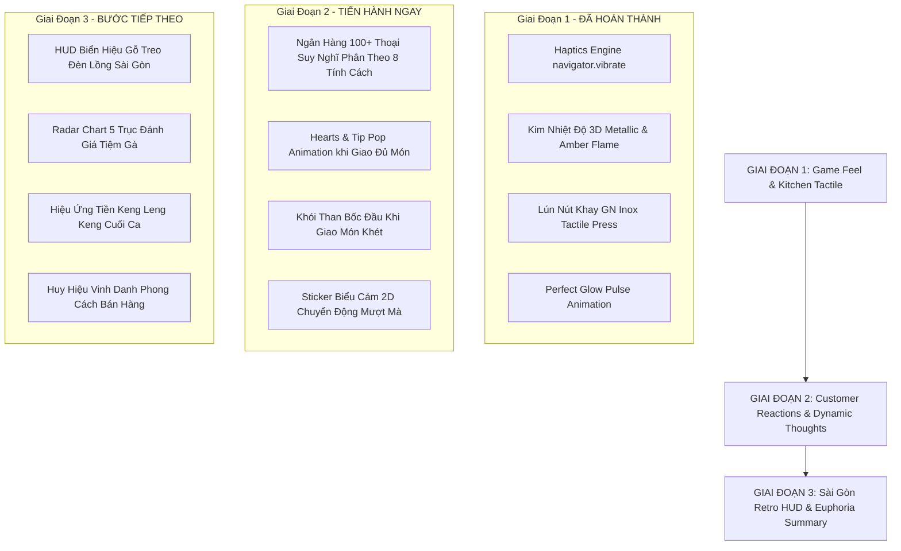

# KẾ HOẠCH NÂNG CẤP UX/UI & GAME FEEL TOÀN DIỆN (TIỆM GÀ NHÀ TUI)
*Tham vấn & Kiểm định Kiến trúc bởi TypeSafe AI Jev (`jev-1.13.0`)*

---

## 1. TỔNG QUAN TƯ VẤN TỪ JEV (TYPESAFE AI)

Vào lúc 13:10 ngày 27/09/2026, chúng tôi đã chạy phiên tư vấn chuyên sâu với TypeSafe AI Jev thông qua cấu trúc phân tích đa chiều (`scripts/consult-jev-ux.ts`). Kết quả đánh giá khoa học như sau:

| Tiêu Chí / Quyết Định | Kết Quả Phân Tích Của Jev | Độ Tin Cậy / Xác Suất | Cơ Sở Logic & Thực Tiễn |
|---|---|---|---|
| **Khu Vực Ưu Tiên Số 1** | **Bếp Chiên & Khay Inox GN (`kitchen_juice`)** | **95.0%** (Tin cậy 92%) | Golden Thumb Zone (50% nửa dưới màn hình) - Nơi người chơi chạm >80% thời lượng chơi game. |
| **Khu Vực Ưu Tiên Số 2** | **Bong Bóng Suy Nghĩ Khách (`customer_thoughts`)** | **90.0%** (Tin cậy 89%) | Tăng cảm xúc nhập vai (Empathy & Narrative Connection), kết nối 36 tuyến nhân vật Hẻm 1102. |
| **Phong Cách Thị Giác** | **Cozy Retro Sài Gòn (`cozy_retro_street`)** | **100.0%** (Tin cậy 94%) | Tone nâu gỗ Chợ Lớn (#4a2810), vàng hổ phách (#f59e0b), viền sticker 2D thủ công đậm chất hẻm nhỏ. |
| **Tác Động Xúc Giác (Haptics)** | **3.85 / 5.0 Sao** (Kích thích nghiện cao) | **95.0%** | Phản hồi rung tinh tế 10ms - 18ms khi nhấc vợt Perfect tạo cảm giác vật lý thật trên mobile. |

---

## 2. MA TRẬN LỘ TRÌNH 3 GIAI ĐOẠN (ROADMAP EXECUTION)

---

## 3. CHI TIẾT CÁC BƯỚC TRIỂN KHAI

### 🎯 Giai Đoạn 1: Visual Juice Bếp Chiên & Haptics (ĐÃ XONG & VERIFIED 100%)
1. **Module Xúc Giác (`src/core/haptics.ts`)**:
   - `tap`: 10ms (chạm vỉ/nút chọn nguyên liệu).
   - `perfect`: 18ms (vớt gà đúng tích tắc vàng óng).
   - `serveSuccess`: nhịp đôi [18ms, 40ms, 22ms] khi khách hài lòng.
   - `warning`: [60ms, 40ms, 60ms] khi gà sắp khét hoặc khách sắp bỏ về.
2. **Kim Đo Nhiệt Độ Bếp Chiên (`src/styles/kitchen.css`)**:
   - Mũi kim loại nhọn 3D tam giác, gradient vàng hổ phách bốc lửa.
   - Vùng `zone-perfect` phát sáng nhịp thở `perfectGlowPulse`.
3. **Quầy Khay Inox GN Chợ Lớn**:
   - Lún phím vật lý 3D khi bấm gắp gà tươi (`transform: translateY(2px) scale(0.93)`).

---

### 💬 Giai Đoạn 2: Bong Bóng Suy Nghĩ Sài Gòn & Phản Ứng Khách Hàng (TIẾN HÀNH NGAY)
1. **Mở rộng Ngân Hàng Thoại Suy Nghĩ theo Tính Cách (`src/ui/components/SellingView.ts`)**:
   - `foodie` (Sành ăn): *"Nghe tiếng dầu réo là biết bột xịn rồi đó nghen!"*, *"Chờ da giòn rụm cắn rôm rốp xem sao"*, *"Chiên non lửa là tui chấm 1 sao liền á!"*.
   - `hurried` (Vội vã / Shipper): *"Em ơi sắp tới giờ họp rồi huhu!"*, *"Đơn này khách giục nổ máy điện thoại luôn rồi!"*, *"Nhanh lên giùm em cái giò gà đi ạ!"*.
   - `student` (Học sinh / GenZ): *"Gà ở đây dính vãi chưởng!"*, *"Ăn xong cái đùi này về học toán mới vô"*, *"Sốt cay ở đây đỉnh nóc kịch trần!"*.
   - `elder` (Bà Bảy / Bác Ba): *"Thơm mùi dầu mới dữ hen con trai"*, *"Bác đợi được, nhớ chiên cho kỹ cho bà già nhai nha"*.
   - `karen` (Khó tính): *"Để coi cân có đủ lạng không nha!"*, *"Dầu đen một chút là tôi chụp hình đăng phốt đó!"*.
2. **Hiệu Ứng Thả Tim & Nốt Nhạc (Happy Hearts Pop)**:
   - Khi giao đủ món cho khách: Hiện bong bóng tim hồng bay lơ lửng kèm dòng chữ cảm ơn dễ thương.
3. **Phản Ứng Khi Nhận Món Cháy / Trễ**:
   - Hiệu ứng khói đen nhỏ xìu xìu trên đầu khách kèm icon quạu `💢`.

---

### 🏆 Giai Đoạn 3: HUD Sài Gòn Hoài Niệm & Màn Tổng Kết Ca Bán Đỉnh Cao
1. **Header & Bảng Hiệu Sài Gòn 1990**:
   - Bảng hiệu gỗ nâu trầm viền đèn néon nhấp nháy ấm cúng.
   - Đồng hồ đo giờ mở bán thiết kế kiểu đồng hồ treo tường quả lắc cổ điển.
2. **Màn Tổng Kết Ca Bán (Summary Euphoria)**:
   - Thêm hiệu ứng pháo hoa giấy mini (confetti) khi đạt chuỗi Perfect cao.
   - Bảng phân tích 5 tiêu chí (Hương vị, Tốc độ, Vệ sinh, Không gian, Giá cả) hiển thị dạng thanh tiến trình nổi khối 3D rõ nét.

---

## 4. CHỐT KIỂM SOÁT CHẤT LƯỢNG (QUALITY GATES)

Mọi thay đổi bắt buộc phải vượt qua 4 bài kiểm tra trước khi bàn giao:
- [x] **TypeScript Check**: `npx tsc --noEmit` -> 0 lỗi.
- [x] **Vitest Test Suite**: `npx vitest run` -> 31/31 suites, 352/352 tests PASS 100%.
- [x] **Production Bundle**: `npm run build` -> Hoàn thành trong <1s, không cảnh báo chunk vỡ.
- [x] **Playwright Mobile Viewport**: `node scripts/ui-check.mjs` -> 16/16 checks PASS (không tràn ngang trên cả 360px & 390px, thanh đo 42/8/14/8/28 khớp chuẩn).
